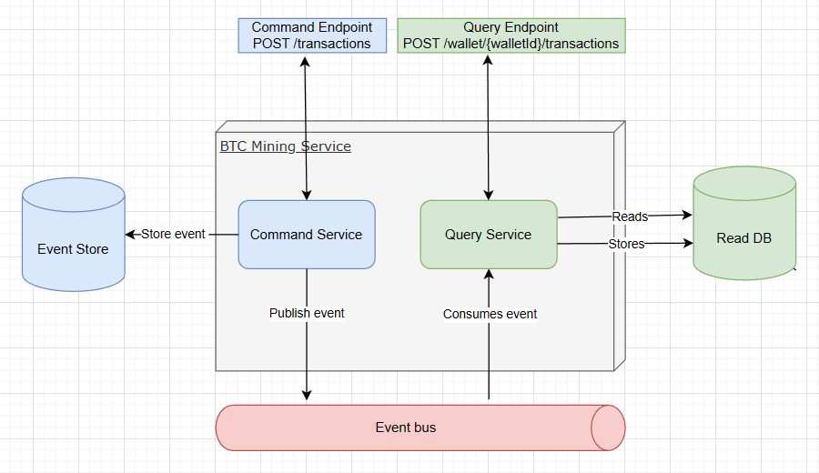
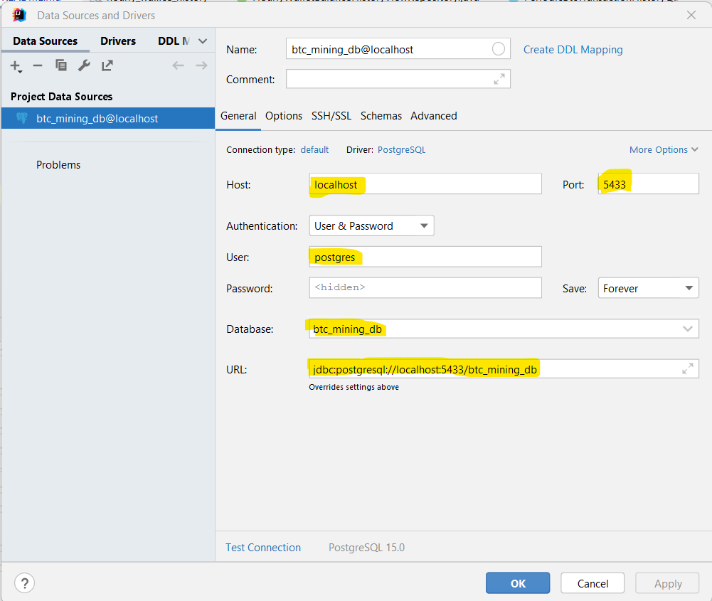
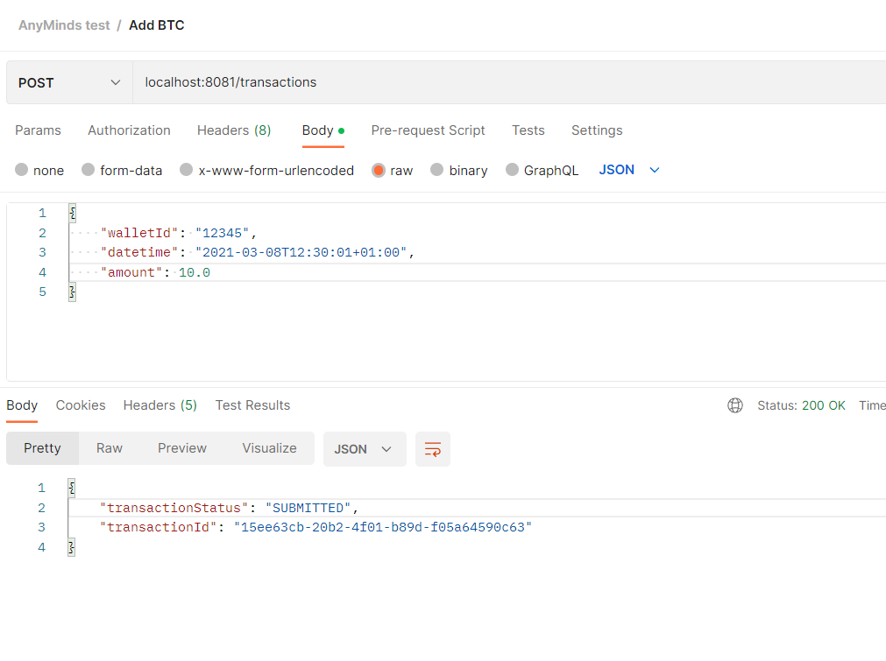
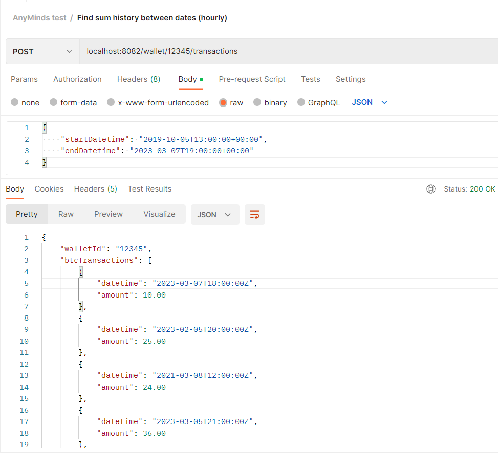

# anymind-test-project

## High Level Architectural diagram



## Assumptions
- Since Wallet and time zones were mentioned, but from request model it was not clear that if an wallet entity should exists, I didn't keep Wallet as the Aggregate, instead I kept the Transaction as the aggregate
- But I kept walletId just to explain that I had this in mind

## Further Improvement
- Can be added pagination for the Sum History between dates
- Sum history can be based on monthly sum, weekly sum etc. We will need to add view tables and request param to pass for the intervalType

## Run the application
From the root directory where the docker-compose.yml file exists, run ```docker-compose up```

## Connect to the DB from your DB client
Once the database and other services are up and running by docker compose, use the following parameters to connect to the DB server via your DB client.

The Password is: ```secret```



## Create View table in case it is not automatically created

Run the following SQL script to create the view table
```
CREATE VIEW hourly_wallet_balance_history AS
SELECT row_number() OVER () as id, date_trunc('hour', datetime) as datetime_hour, wallet_id, sum(amount) as balance
FROM transaction
GROUP BY date_trunc('hour', datetime), wallet_id;
```

## Axon Server Dashboard

Go to http://localhost:8024/#query

## Test the Application

Postman Collection has been attached in the directory ```./postman-collection```

#### Add BTC




#### Find Sum History between dates (by hour)

